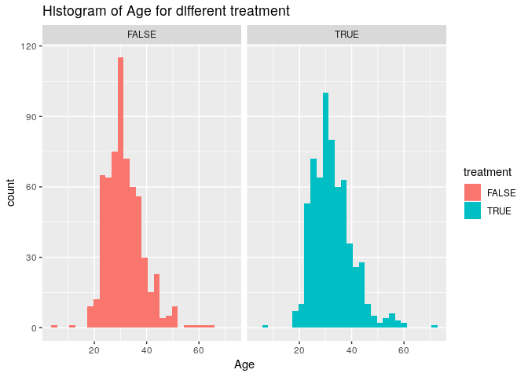

# Set up for this workshop 

## Getting R and R studio

> R is a programming language for statistical computing and data science.   
> RStudio is a free and open-source integrated development environment (IDE) for R, which make your life easier.

1. Download and install R from here: http://cran.stat.sfu.ca/.
2. Download and install RStudio Desktop (Open Source Edition) from here: https://www.rstudio.com/products/rstudio/#Desktop.

## Getting this document on your computer:

1. Go to the GitHub repository here: https://github.com/xinbinhuang/lumohacks-workshop
2. Click the green button on the right that says "Clone or download".
3. Click "Download ZIP". (If you're proficient with git, feel free to clone the repository.)
4. Create a folder on your computer to store your work, and store your ZIP file there.
5. Double-click your ZIP file to unzip it and get all the code.
6. In RStudio, open `eda_workshop.Rmd`, a file in `YOUR_FOLDER/eda/`

## Installing packages

There are some packages required for this workshop. 
- `dplyr`: for data wrangling
- `ggplot2`: for data visualization

You can install the packages using the code snippt below. (remove the hashtags first, and then to run the code by clicking the green "play" button, or with `Ctrl + Enter`)


```r
# install.packages("dplyr")
# install.packages("ggplot2")
```

# What will we do today?
- A quick intro to exploratory data analysis (EDA)
- Learn how to look at the data
- Learn data wrangling and visualization with `dplyr` and `ggplot2`

## Some useful hacks

To execute a line of code, move your cursor to that line and then type `Ctrl+Enter`. For example:


```r
# Move your cursor to the line below, and type Ctrl-Enter.
print("Welcome to exploratory data analysis workshop!")
```

```
## [1] "Welcome to exploratory data analysis workshop!"
```

To assign values to variables, we use <- -- quickly get this with `Alt+-`


```r
x <- 4
```

Comment or uncomment the a line of code, move your cursor to that line and then type `Ctrl+Shift+C`. For example:


```r
# print("Please uncomment me with the magic trick!")
```


#. Finish setting up? Let's get started!
## What is Exploratory Data Analysis (EDA), and why would you care?

> In statistics, exploratory data analysis (EDA) is an approach to analyzing data sets to summarize their main characteristics, often with visual methods.                 --- Wikipedia
               
EDA serves many purposes, including 

- better understanding the structure of the data (i.e. data types, summary statitics), and identifying relationships between variables. 
- checking for problems with the data (i.e. missing data or measurement error) 
- helping in forming hypothesis

EDA is **important** because it provides analysts a better idea about what should they focus on, or just decide to stop if the data don't provide any information before they further putting resources into it.

Today, we're going to work with *data frame*, a key data structure in statistics and in R with each observation per row and each variable per column. And, we are going to do a simple EDA with `dplyr` and `ggplot2`

For `dplyr`, there are 5 main functions for data wrangling:

- `select()`: get a subset of columns
- `filter()`: get a subset of rows
- `mutate()`: create a new column
- `group_by()`: define groups according to the values in one or more columns
- `summarise()`: reduce many rows down to a single value of interest.

For `ggplot2`, we will go through:

- set up a plot with `ggplot()`
- Choose which variables to plot using argument `mapping = aes(x, y)` in `ggplot()`
- Choose which type of plot using `geom_`
- Add title and subtitle using `labels`

Let's load the packages for this workshop.


```r
library(dplyr)
library(ggplot2)
```

## Take a look at the data
The data that we will be using can be found here, [Kaggle : mental health in tech survey](https://www.kaggle.com/osmi/mental-health-in-tech-survey)

Before we try to do anything fancy, we need to first understand what does the data *looks like*. Let's look at the a first few rows of the data with `head()`.


```r
# load the data
mental_data <- read.csv('../data/workshop_survey.csv')

# look at the first 6 lines of the data
head(mental_data)
```

```
##   X           Timestamp Age Gender        Country state self_employed
## 1 1 2014-08-27 11:29:31  37 female  United States    IL          <NA>
## 2 2 2014-08-27 11:29:37  44   male  United States    IN          <NA>
## 3 3 2014-08-27 11:29:44  32   male         Canada  <NA>          <NA>
## 4 4 2014-08-27 11:29:46  31   male United Kingdom  <NA>          <NA>
## 5 5 2014-08-27 11:30:22  31   male  United States    TX          <NA>
## 6 6 2014-08-27 11:31:22  33   male  United States    TN          <NA>
##   family_history treatment work_interfere   no_employees remote_work
## 1             No       Yes          Often           6-25          No
## 2             No        No         Rarely More than 1000          No
## 3             No        No         Rarely           6-25          No
## 4            Yes       Yes          Often         26-100          No
## 5             No        No          Never        100-500         Yes
## 6            Yes        No      Sometimes           6-25          No
##   tech_company   benefits care_options wellness_program  seek_help
## 1          Yes        Yes     Not sure               No        Yes
## 2           No Don't know           No       Don't know Don't know
## 3          Yes         No           No               No         No
## 4          Yes         No          Yes               No         No
## 5          Yes        Yes           No       Don't know Don't know
## 6          Yes        Yes     Not sure               No Don't know
##    anonymity              leave mental_health_consequence
## 1        Yes      Somewhat easy                        No
## 2 Don't know         Don't know                     Maybe
## 3 Don't know Somewhat difficult                        No
## 4         No Somewhat difficult                       Yes
## 5 Don't know         Don't know                        No
## 6 Don't know         Don't know                        No
##   phys_health_consequence    coworkers supervisor mental_health_interview
## 1                      No Some of them        Yes                      No
## 2                      No           No         No                      No
## 3                      No          Yes        Yes                     Yes
## 4                     Yes Some of them         No                   Maybe
## 5                      No Some of them        Yes                     Yes
## 6                      No          Yes        Yes                      No
##   phys_health_interview mental_vs_physical obs_consequence comments   n
## 1                 Maybe                Yes              No     <NA> 121
## 2                    No         Don't know              No     <NA> 116
## 3                   Yes                 No              No     <NA> 615
## 4                 Maybe                 No             Yes     <NA> 615
## 5                   Yes         Don't know              No     <NA> 615
## 6                 Maybe         Don't know              No     <NA> 615
```

We can also use the `str()` function to overview the data, which nicely present the number of rows and columsn, variable names, data types, and example values. 


```r
str(mental_data)
```

```
## 'data.frame':	1259 obs. of  29 variables:
##  $ X                        : int  1 2 3 4 5 6 7 8 9 10 ...
##  $ Timestamp                : Factor w/ 1246 levels "2014-08-27 11:29:31",..: 1 2 3 4 5 6 7 8 9 10 ...
##  $ Age                      : num  37 44 32 31 31 33 35 39 42 23 ...
##  $ Gender                   : Factor w/ 3 levels "female","male",..: 1 2 2 2 2 2 1 2 1 2 ...
##  $ Country                  : Factor w/ 48 levels "Australia","Austria",..: 46 46 8 45 46 46 46 8 46 8 ...
##  $ state                    : Factor w/ 45 levels "AL","AZ","CA",..: 11 12 NA NA 38 37 19 NA 11 NA ...
##  $ self_employed            : Factor w/ 2 levels "No","Yes": NA NA NA NA NA NA NA NA NA NA ...
##  $ family_history           : Factor w/ 2 levels "No","Yes": 1 1 1 2 1 2 2 1 2 1 ...
##  $ treatment                : Factor w/ 2 levels "No","Yes": 2 1 1 2 1 1 2 1 2 1 ...
##  $ work_interfere           : Factor w/ 4 levels "Never","Often",..: 2 3 3 2 1 4 4 1 4 1 ...
##  $ no_employees             : Factor w/ 6 levels "1-5","100-500",..: 5 6 5 3 2 5 1 1 2 3 ...
##  $ remote_work              : Factor w/ 2 levels "No","Yes": 1 1 1 1 2 1 2 2 1 1 ...
##  $ tech_company             : Factor w/ 2 levels "No","Yes": 2 1 2 2 2 2 2 2 2 2 ...
##  $ benefits                 : Factor w/ 3 levels "Don't know","No",..: 3 1 2 2 3 3 2 2 3 1 ...
##  $ care_options             : Factor w/ 3 levels "No","Not sure",..: 2 1 1 3 1 2 1 3 3 1 ...
##  $ wellness_program         : Factor w/ 3 levels "Don't know","No",..: 2 1 2 2 1 2 2 2 2 1 ...
##  $ seek_help                : Factor w/ 3 levels "Don't know","No",..: 3 1 2 2 1 1 2 2 2 1 ...
##  $ anonymity                : Factor w/ 3 levels "Don't know","No",..: 3 1 1 2 1 1 2 3 2 1 ...
##  $ leave                    : Factor w/ 5 levels "Don't know","Somewhat difficult",..: 3 1 2 2 1 1 2 1 4 1 ...
##  $ mental_health_consequence: Factor w/ 3 levels "Maybe","No","Yes": 2 1 2 3 2 2 1 2 1 2 ...
##  $ phys_health_consequence  : Factor w/ 3 levels "Maybe","No","Yes": 2 2 2 3 2 2 1 2 2 2 ...
##  $ coworkers                : Factor w/ 3 levels "No","Some of them",..: 2 1 3 2 2 3 2 1 3 3 ...
##  $ supervisor               : Factor w/ 3 levels "No","Some of them",..: 3 1 3 1 3 3 1 1 3 3 ...
##  $ mental_health_interview  : Factor w/ 3 levels "Maybe","No","Yes": 2 2 3 1 3 2 2 2 2 1 ...
##  $ phys_health_interview    : Factor w/ 3 levels "Maybe","No","Yes": 1 2 3 1 3 1 2 2 1 1 ...
##  $ mental_vs_physical       : Factor w/ 3 levels "Don't know","No",..: 3 1 2 2 1 1 1 2 2 3 ...
##  $ obs_consequence          : Factor w/ 2 levels "No","Yes": 1 1 1 2 1 1 1 1 1 1 ...
##  $ comments                 : Factor w/ 160 levels " ","-","(yes but the situation was unusual and involved a change in leadership at a very high level in the organization"| __truncated__,..: NA NA NA NA NA NA NA NA NA NA ...
##  $ n                        : int  121 116 615 615 615 615 121 116 121 615 ...
```

The `summary()` is also useful to calculate quick summary statistics of the data.

```r
# here only calculate the summary of the first 6 columns
summary(mental_data[, 1:6])
```

```
##        X                        Timestamp         Age            
##  Min.   :   1.0   2014-08-27 12:31:41:   2   Min.   :-1.726e+03  
##  1st Qu.: 315.5   2014-08-27 12:37:50:   2   1st Qu.: 2.700e+01  
##  Median : 630.0   2014-08-27 12:43:28:   2   Median : 3.100e+01  
##  Mean   : 630.0   2014-08-27 12:44:51:   2   Mean   : 7.943e+07  
##  3rd Qu.: 944.5   2014-08-27 12:54:11:   2   3rd Qu.: 3.600e+01  
##  Max.   :1259.0   2014-08-27 14:22:43:   2   Max.   : 1.000e+11  
##                   (Other)            :1247                       
##     Gender              Country        state    
##  female:236   United States :751   CA     :138  
##  male  :971   United Kingdom:185   WA     : 70  
##  other : 52   Canada        : 72   NY     : 57  
##               Germany       : 45   TN     : 45  
##               Ireland       : 27   TX     : 44  
##               Netherlands   : 27   (Other):390  
##               (Other)       :152   NA's   :515
```

You may also need to verify the data. For example, to check if there are missing values. Though we are not going to deal with missing values in this workshop, you should know that missing values would affect your analysis and may need to take care of them by removing or imputation (i.e. impute with mean).

```r
# calculate the number of NAs in each column
check_na <- function(x) {
      return(colSums(is.na(x)))
}

check_na(mental_data)
```

```
##                         X                 Timestamp 
##                         0                         0 
##                       Age                    Gender 
##                         0                         0 
##                   Country                     state 
##                         0                       515 
##             self_employed            family_history 
##                        18                         0 
##                 treatment            work_interfere 
##                         0                       264 
##              no_employees               remote_work 
##                         0                         0 
##              tech_company                  benefits 
##                         0                         0 
##              care_options          wellness_program 
##                         0                         0 
##                 seek_help                 anonymity 
##                         0                         0 
##                     leave mental_health_consequence 
##                         0                         0 
##   phys_health_consequence                 coworkers 
##                         0                         0 
##                supervisor   mental_health_interview 
##                         0                         0 
##     phys_health_interview        mental_vs_physical 
##                         0                         0 
##           obs_consequence                  comments 
##                         0                      1095 
##                         n 
##                         0
```

## Formulate a question
One good practice for exploratory data analysis process is to formulate a question and let it guide you through the process. It helps reduce the number of all potentail paths down to a manageble number, which is extremely helpful for high-dimentional dataset.

In particular, we would try to answer this question for this workshop:
> Q: How did a person's age group, gender, and employee wellness program related to the likelihood of seeking treatment for mental health condition.

To answer this question, we would need to have these columns:

- `Age`: the person's age, in years
- `Gender`: the person's gender
- `wellness_program`: does the employee wellness program includes mental health
- `treatment`: have a person sought treatment for a mental health condition

## Subsetting columns with `select()`  

`select()` takes a list of column names, and returns a dataframe but with only those columns. Let's see `select()` in action with a toy dataframe.


```r
toy_dataframe <- data.frame(
      patient     = c("Alice",           "Bob",         "Cathy",              "Daisy"),
      disease     = c("Mental disorder", "Depression",  "Mental disorder",    "Depression"),
      disease_len = c(1.5,               1.5,           0.1,                  3),
      age         = c(24,                22,            16,                   30)
)

# let's take a look
toy_dataframe
```

```
##   patient         disease disease_len age
## 1   Alice Mental disorder         1.5  24
## 2     Bob      Depression         1.5  22
## 3   Cathy Mental disorder         0.1  16
## 4   Daisy      Depression         3.0  30
```

```r
# let's select the 'disease' column
select(.data = toy_dataframe, disease)
```

```
##           disease
## 1 Mental disorder
## 2      Depression
## 3 Mental disorder
## 4      Depression
```

With the pipe operator : ` %>% `, this takes the output of the preceding line of code, and passes it in as the first argument of the next line. You can think of *pipe* as the word "then". So, the code below would be read as "start with `toy_dataframe`, then `select` disease.


```r
toy_dataframe %>% 
      select(disease)
```

```
##           disease
## 1 Mental disorder
## 2      Depression
## 3 Mental disorder
## 4      Depression
```


### Practice: subsetting the `Age` and `treatment` columns.

Using our mental survey dataframe, select just the `Age` and `treatment` columns.


```r
mental_data %>% 
      select(
            # your answer here!
      ) %>% 
      head()
```

```
## data frame with 0 columns and 6 rows
```


Great. Now let's grab the 4 variables of interest, and save them in a new dataframe.  
(Though this step is not necessary, it will make it easier to analyze the variables that we care about. This is more useful when the total number of variables of the original dataframe is big!)


```r
mental_data_selected <- mental_data %>% 
      select(Age, Gender, wellness_program, treatment)

# let's take a look
mental_data_selected %>% 
      head()
```

```
##   Age Gender wellness_program treatment
## 1  37 female               No       Yes
## 2  44   male       Don't know        No
## 3  32   male               No        No
## 4  31   male               No       Yes
## 5  31   male       Don't know        No
## 6  33   male               No        No
```

## Subsetting rows with `filter()`

It is common that your data may contains error entries or missing values, and you want to remove them. Or you may want to subset rows that satisfy some condictions.  

We can use the `filter()` function from `dplyr` to do this - keeps only the rows in a dataframe that match a condition. For example:


```r
toy_dataframe
```

```
##   patient         disease disease_len age
## 1   Alice Mental disorder         1.5  24
## 2     Bob      Depression         1.5  22
## 3   Cathy Mental disorder         0.1  16
## 4   Daisy      Depression         3.0  30
```

```r
# Use `==` for "equals"
toy_dataframe %>% 
  filter(patient == "Alice")
```

```
##   patient         disease disease_len age
## 1   Alice Mental disorder         1.5  24
```

```r
# Greater than is `>`, lesser than is `<`.
toy_dataframe %>% 
      filter(age > 23)
```

```
##   patient         disease disease_len age
## 1   Alice Mental disorder         1.5  24
## 2   Daisy      Depression         3.0  30
```

```r
# Use `|` for "or".
toy_dataframe %>% 
  filter(patient == "Bob" | patient == "Cathy")
```

```
##   patient         disease disease_len age
## 1     Bob      Depression         1.5  22
## 2   Cathy Mental disorder         0.1  16
```

```r
# In `filter()`, each comma-separation is treated as "and". But you could also use `&`.
toy_dataframe %>% 
  filter(patient == "Bob" | patient == "Cathy",
         disease == "Fever")
```

```
## [1] patient     disease     disease_len age        
## <0 rows> (or 0-length row.names)
```

```r
# Use `!` for negation. This turns `TRUE` into `FALSE` and `FALSE into `TRUE`.
toy_dataframe %>% 
  filter(age != 22,
         patient != "Cathy")
```

```
##   patient         disease disease_len age
## 1   Alice Mental disorder         1.5  24
## 2   Daisy      Depression         3.0  30
```

### Practice: find out `Age` that does not make sense.
You may expect that the `Age` of people range 0 to 100, and those out of the range may be treated as outliers. Now we check if there are observations outside this range.s


```r
# filter rows where `age < 0`
mental_data_selected %>% 
      filter(
            # answer here
      )

# filter rows where `age > 100`
mental_data_selected %>% 
      filter(
            # answer here
      )
```

In the code snippet below, I remove rows where `Age` is larger than 100 or smaller than 0. 

```r
mental_data_filtered <- mental_data_selected %>% 
      filter(Age < 100, Age > 0)
```

Let's check the number of rows being removed, and it should be 5.

```r
paste("Number of rows removed:", 
      nrow(mental_data_selected) - nrow(mental_data_filtered))
```

```
## [1] "Number of rows removed: 5"
```

## Creating new columns with `mutate()`

Next, we are going create a column that tells us what was the person's age group, "0-24", "25-34", and "35+". 

We will use the `mutate()` function and the `Age` column to aggregate the results.

Let's look at the following examples:


```r
toy_dataframe
```

```
##   patient         disease disease_len age
## 1   Alice Mental disorder         1.5  24
## 2     Bob      Depression         1.5  22
## 3   Cathy Mental disorder         0.1  16
## 4   Daisy      Depression         3.0  30
```

```r
# We can fill our new column with whatever we like!
toy_dataframe %>% 
  mutate(new_column = "hello!")
```

```
##   patient         disease disease_len age new_column
## 1   Alice Mental disorder         1.5  24     hello!
## 2     Bob      Depression         1.5  22     hello!
## 3   Cathy Mental disorder         0.1  16     hello!
## 4   Daisy      Depression         3.0  30     hello!
```

```r
toy_dataframe %>% 
  mutate(new_column = 2018)
```

```
##   patient         disease disease_len age new_column
## 1   Alice Mental disorder         1.5  24       2018
## 2     Bob      Depression         1.5  22       2018
## 3   Cathy Mental disorder         0.1  16       2018
## 4   Daisy      Depression         3.0  30       2018
```

Besides, we can even use the other columns to determine the contents of the new one. Let's compute when did the person first diagnosed with the disease.


```r
# nice! we get the `first_diagnosed` time 
toy_dataframe %>% 
      mutate(first_diagnosed = age - disease_len)
```

```
##   patient         disease disease_len age first_diagnosed
## 1   Alice Mental disorder         1.5  24            22.5
## 2     Bob      Depression         1.5  22            20.5
## 3   Cathy Mental disorder         0.1  16            15.9
## 4   Daisy      Depression         3.0  30            27.0
```

### Practice: calculate the max, min and average for the `Age`
Use `mutate()` and `Age` to calculate the max, min, and mean called `max_age`, `min_age`, and `mean_age`.

Hint: use functions `max()`, `min()`, and `mean()`. You can use `?max` to look up the documentation.


```r
mental_data_filtered %>% 
      mutate(
            # your answer here
      ) %>% 
      head()
```

To answer our question, we will need to use another function `case_when()`.

`case_when()` takes a series of two-side formulas. The left-hand side of each formula is a condition, and the right-hand side is the desired output. For example:


```r
cool_values <- c(TRUE, FALSE, FALSE)

cool_values
```

```
## [1]  TRUE FALSE FALSE
```

```r
case_when(
  cool_values == TRUE ~ "hey there!",
  cool_values == FALSE ~ "what's up?"
)
```

```
## [1] "hey there!" "what's up?" "what's up?"
```

```r
cool_numbers <- c(1,2,3,4,5,6,7,8,9,10)

cool_numbers
```

```
##  [1]  1  2  3  4  5  6  7  8  9 10
```

```r
case_when(
  cool_numbers < 5 ~ "small",
  cool_numbers > 5 ~ "BIG!!!!",
  TRUE ~ "default_value"
)
```

```
##  [1] "small"         "small"         "small"         "small"        
##  [5] "default_value" "BIG!!!!"       "BIG!!!!"       "BIG!!!!"      
##  [9] "BIG!!!!"       "BIG!!!!"
```
Now, we are going to use `case_when()` within `mutate()` to create a new column that tells us whether the person's age was in the groups we're interested in:


```r
# Let's save the result in a new dataframe called `mental_data_mutated`.
mental_data_mutated <- mental_data_filtered %>% 
      mutate(
            AgeGroup = case_when(
            Age < 25             ~ "0-24",
            Age >= 25 & Age < 35 ~ "25-34",
            Age >= 35            ~ "35+"
      )
)

# Let's take a look!
mental_data_mutated %>% 
      head()
```

```
##   Age Gender wellness_program treatment AgeGroup
## 1  37 female               No       Yes      35+
## 2  44   male       Don't know        No      35+
## 3  32   male               No        No    25-34
## 4  31   male               No       Yes    25-34
## 5  31   male       Don't know        No    25-34
## 6  33   male               No        No    25-34
```

## Computing aggregated summaries of subgroups with `group_by()` & `summarise()`

Now we need to compute the proportion of people who seeked for treatment across different Gender.

To do this, we can use two functions: 

- `group_by()`: specifies which variable(s) you want to use to compute summaries within
- `summarise()`: squishes the dataframe down to just one row per group, creating a column with whatever summary value you specify

Let's look at some examples:


```r
toy_dataframe
```

```
##   patient         disease disease_len age
## 1   Alice Mental disorder         1.5  24
## 2     Bob      Depression         1.5  22
## 3   Cathy Mental disorder         0.1  16
## 4   Daisy      Depression         3.0  30
```

```r
# you can use `summarise` alone to calculate the 
# summary statistics of the whole data frame
toy_dataframe %>% 
      summarise(mean_age = mean(age))
```

```
##   mean_age
## 1       23
```

```r
# also, you can use `group_by` and `summarise` 
# to calculate the mean age for each diasese
toy_dataframe %>% 
      group_by(disease) %>% 
      summarise(mean_age = mean(age))
```

```
## # A tibble: 2 x 2
##   disease         mean_age
##   <fct>              <dbl>
## 1 Depression            26
## 2 Mental disorder       20
```

```r
# or we can also get the max and min of the age
toy_dataframe %>% 
      group_by(disease) %>% 
      summarise(
            min_age = min(age),
            max_age = max(age)
            )
```

```
## # A tibble: 2 x 3
##   disease         min_age max_age
##   <fct>             <dbl>   <dbl>
## 1 Depression           22      30
## 2 Mental disorder      16      24
```

### Practice: calculate average age for different groups
Now, let's calculate the average age for people who seeked for treatment and for those who did not.


```r
mental_data_mutated %>% 
      group_by(
            # your answer
      ) %>% 
      summarise(
            # your answer
      ) 
```

To compute the proportion of people who seeked for treatment across different Gender, we need to first encode the values of `treatment` from `Yes` and `No` to TRUE and FALSE. We can do this use `mutate()` with `case_when()`.


```r
mental_data_mutated <- mental_data_mutated %>% 
      mutate(treatment = case_when(
            treatment == "Yes" ~ TRUE,
            treatment == "No" ~ FALSE
      ))
```

Now we can compute the summary by grouping `Gender` and take the mean of `treatment` (i.e. in R, `TRUE == 1` and `FALSE == 0`)


```r
mental_data_summarised <- mental_data_mutated %>% 
      group_by(Gender) %>% 
      summarise(proportion_treatment = mean(treatment))

mental_data_summarised
```

```
## # A tibble: 3 x 2
##   Gender proportion_treatment
##   <fct>                 <dbl>
## 1 female                0.699
## 2 male                  0.452
## 3 other                 0.6
```

## Visualization with `ggplot2`

The `ggplot2` package is the best way to create visualizations in R, based on *The Grammar of Graphics*. The code for each visualization comes in two main pieces:

- Mapping of variables onto aesthetics (the visual properties of the graph). For example, we can map `treatment` to x-axis, and `Age` to y-axis.
- Selection of a "geom" ("geometric object"): it determines if you want a scatter plot, a histogram or a line.

### Set up a graph
To start a visualization, we need to use `ggplot()`, which helps to set up a graph. However, this only initiate a blank space if we call it alone.

We need to map different variables into different aesthestics, and most importantly the axis. To set up the axis, we use argument `mapping = aes(x, y)`. Here, let's put treatment in x-axis and Age in y-axis.


```r
mental_data_mutated %>% 
      ggplot(mapping = aes(x = treatment, y = Age)) 
```

<!-- -->

After setting up the axis, we need to decide the geometric object. In this case, we would use the box plot.


```r
mental_data_mutated %>% 
      ggplot(mapping = aes(x = treatment, y = Age)) +
      geom_boxplot()
```

<!-- -->

To make the plot more descriptive, we will add a title and labels for x- and y- axis.


```r
mental_data_mutated %>% 
      ggplot(mapping = aes(x = treatment, y = Age)) +
      geom_boxplot() +
      labs(title = "Box-plot of Age for different treatment groups",
           # just for illustration 
           # labels for x- and y- axis is not necessary in this case
           x = "Treatment",  
           y = "Age")
```

<!-- -->

Wow! It looks like that younger people are less likely to have mental problems.

Other than box plot, there are other `geom_` objects useful for EDA:
 
- `geom_point()`: scatter plot; useful two quantitative variables
- `geom_bar()` and `geom_col`: bar chart;  `geom_bar()` automatically counts the number of x as y values. In order to provide your own y values, we use `geom_col()`.
- `geom_histogram()` and `geom_density()`: histogram and density plot; useful to visualize the distribution of continuous variables.

Let's look at again the age distribution for different treatment, but this time with `geom_histogram`, and faceting the plot into two panels with `facet_wrap`.

> Tips: To make the graph prettier, we can supply variable `AgeGroup` to the argument `fill`, which means to fill the bars with different colors.


```r
mental_data_mutated %>% 
      ggplot(mapping = aes(x = Age, fill = treatment)) +
      geom_histogram() +
      facet_wrap(~ treatment) +
      labs(title = "Histogram of Age for different treatment")
```

<!-- -->

Now, let's try use the `geom_col()` to visualize the data for different Gender. 

```r
mental_data_summarised %>% 
      ggplot(mapping = aes(x = Gender, y = proportion_treatment, fill = Gender)) +
      geom_col() +
      labs(title = "Proportion of people with mental condition for different Gender",
           y = "Proportion of mental condition")
```

<!-- -->

Interesting, female are much most likely to have mental problems, while male are least likely to have the problems.

Though these claims may not be statistically significant, they lead you to check the realtionship in future analysis.

### Chanllenge: visualize the relationship between `wellness_program` and `treatment`

> Hint: you may need to `summarize` wellness_program similar to Gender. 


```r
mental_data_mutated %>% 
      # some wrangling
      
      ggplot()
```

## Takeaways

- Formulate your question to guide through the analysis process
- Use `head()`, `str()`, `summary()` to get an idea about the data
- Check missing values, and/or develop strategies to deal with them if necessary
- Wrangle the data, and use visualization to identify relationship


